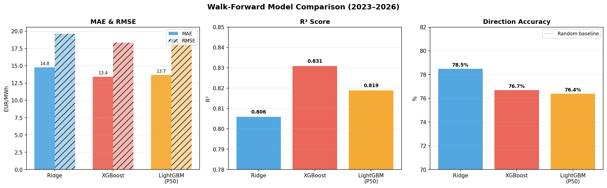
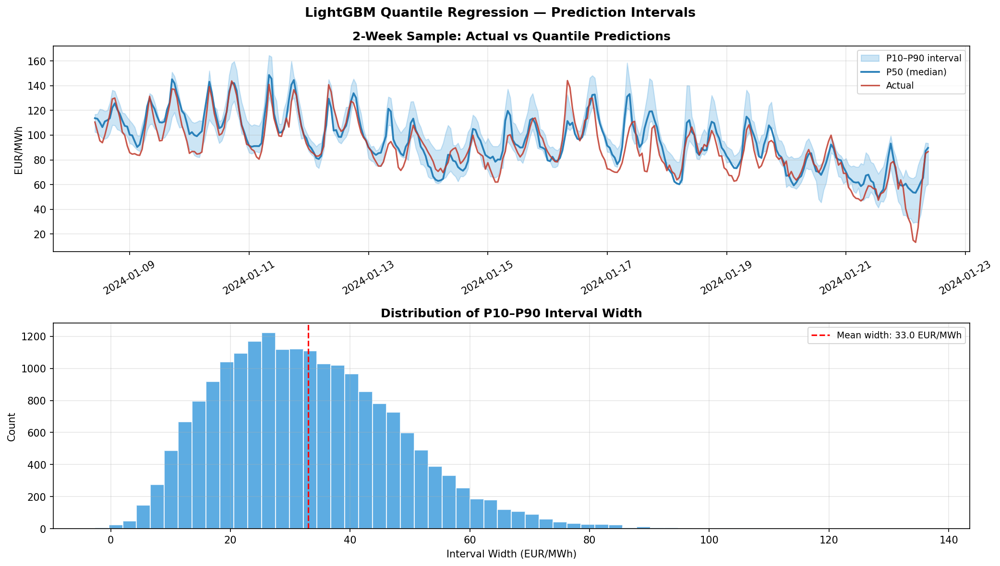

# French Electricity Spot Price Forecasting

An end-to-end MLOps system for day-ahead electricity price forecasting on the French market, combining physical drivers with lagged price signals and a full production pipeline for daily retraining, inference, and monitoring.

---

## Overview

Electricity spot prices are among the most volatile and mean-reverting time series in commodity markets. Unlike financial assets, power cannot be stored at scale, which means real-time supply-demand imbalances — amplified by weather and renewable intermittency — create extreme price dynamics that are nevertheless partially predictable.

This project builds a forecasting system around a single well-defined objective: predict the French day-ahead price (EUR/MWh) 24 hours ahead, trained and evaluated with strict walk-forward validation to avoid any data leakage. The system is built with production operation in mind: daily data ingestion, automated retraining, Docker-based deployment, and a Streamlit dashboard covering data quality, model performance, and drift monitoring.

---

## Data

**Sources:**

| Source | Content | Frequency |
|--------|---------|-----------|
| ENTSO-E Transparency Platform | Day-ahead spot prices (FR, DE) | Hourly |
| ODRE (Open Data Reseaux Energies) | French electricity consumption by region | Hourly |
| Open-Meteo Archive API | Temperature, wind speed, solar radiation, precipitation | Hourly |

**Dataset:** January 2023 — April 2026, 28,405 hourly observations.

**Target variable:** `day_ahead_price` (EUR/MWh), forecasted at horizon t+24h.

The dataset is assembled by `scripts/build_dataset.py`, which pulls from the three sources, aligns on a common UTC hourly index, and computes all derived features. Incremental updates are handled by `src/data/pipeline.py`, which tracks the last successful ingestion date and fetches only new records on each run.

---

## Exploratory Data Analysis

The EDA is documented in [notebooks/01_eda_with_forecasts.ipynb](notebooks/01_eda_with_forecasts.ipynb) and summarised in [docs/FINDINGS.md](docs/FINDINGS.md).

### Price distribution and regime

The French day-ahead price averaged 72 EUR/MWh over the period with high dispersion (std = 48 EUR/MWh). The distribution is right-skewed with occasional spikes above 300 EUR/MWh. Notably, 3.8% of hours carry negative prices — a structural consequence of high renewable penetration where excess generation cannot be absorbed fast enough by flexible thermal assets.

| Statistic | Value |
|-----------|-------|
| Mean | 72 EUR/MWh |
| Median | 75 EUR/MWh |
| Std | 48 EUR/MWh |
| Min | -135 EUR/MWh |
| Max | 473 EUR/MWh |
| Negative price hours | 3.8% |

Prices fell significantly from 2023 (~97 EUR/MWh average) to 2024 (~58 EUR/MWh) as gas prices normalised after the post-crisis spike and new renewable capacity came online.

### Seasonality

Two seasonality patterns are clearly present:

**Intraday:** A double-peak structure — a morning ramp peaking at 8h (~94 EUR/MWh) and a stronger evening peak at 19h (~106 EUR/MWh). Weekend prices are systematically ~20 EUR/MWh lower due to reduced industrial activity.

**Annual:** Winter (January–February) is consistently the most expensive period (~94–104 EUR/MWh) driven by heating demand. Spring (April–May) is the cheapest (~41–59 EUR/MWh) when demand is low and solar output is rising.

### Renewable penetration and negative prices

Average renewable penetration is 24% but ranges from 0% to 73%. When prices go negative, average penetration jumps to 36%, confirming that negative price events are almost exclusively renewable over-generation episodes. Net load (gross consumption minus renewable production) carries a correlation of 0.48 with price and is the strongest non-lag predictor in the dataset.

### Feature correlations

Lagged prices dominate the feature space. The 24-hour lag alone correlates at 0.79 with the target, reflecting strong autocorrelation in the market. Physical features are meaningful but secondary.

| Feature | Correlation with price |
|---------|----------------------|
| price_lag_24h | 0.79 |
| price_roll_mean_24h | 0.78 |
| price_lag_48h | 0.67 |
| price_lag_168h | 0.65 |
| net_load_mw | 0.48 |
| load_mw | 0.46 |
| temperature_2m | 0.34 |

---

## Models

All models are evaluated with **walk-forward validation**: the model is trained on all available past data, predictions are made for the next 24 hours, then the training window expands by one day and the process repeats. This replicates real production conditions with zero look-ahead bias. The test period covers approximately 800 days (~19,000 prediction hours).



### Results

| Model | MAE (EUR/MWh) | RMSE | R² | Direction Accuracy |
|-------|--------------|------|----|--------------------|
| Ridge Regression | 14.77 | 19.62 | 0.806 | 78.5% |
| XGBoost | **13.41** | **18.34** | **0.831** | 76.7% |
| LightGBM P50 | 13.67 | 19.05 | 0.819 | 76.4% |

### Ridge Regression

Ridge is the linear baseline. It performs surprisingly well because the feature space is dominated by lagged prices, which are near-linear predictors. It achieves the highest direction accuracy (78.5%) and retrains in under one second, making it a reliable production baseline.

### XGBoost

Best overall on MAE (-9% vs Ridge) and R² (0.831). Gradient boosting captures non-linear interactions between net load, hour of day, and renewable penetration that a linear model cannot represent. The 24-hour price lag accounts for 27% of feature importance; the 24-hour rolling mean adds 18%. Physical features contribute meaningfully but are secondary to price autocorrelation.

**Top features (XGBoost):**

| Feature | Importance | Category |
|---------|-----------|----------|
| price_lag_24h | 27.0% | Historical |
| price_roll_mean_24h | 18.0% | Historical |
| is_night | 5.2% | Calendar |
| price_lag_168h | 4.6% | Historical |
| solar_production_mw | 4.1% | Renewable |
| is_weekend | 3.7% | Calendar |
| hour | 3.5% | Calendar |
| shortwave_radiation | 2.5% | Weather |

### LightGBM Quantile Regression



LightGBM is trained as a quantile regressor to produce P10/P50/P90 prediction intervals rather than a single point estimate. This adds an uncertainty dimension to every forecast: a narrow interval signals high confidence, a wide interval signals caution.

The P50 median forecast matches XGBoost in accuracy (MAE 13.67). The P10-P90 interval covers 63% of actual observations against a target of 80%, meaning the model is slightly overconfident — the intervals are too narrow on average (mean width 33 EUR/MWh). This is a well-known difficulty with quantile regression on electricity prices due to extreme spikes that are structurally hard to anticipate.

---

## MLOps Architecture

The project is structured as a full production system, not just research notebooks.

### Pipeline

```
scripts/download_data.py     — Pull new data from ENTSO-E, ODRE, Open-Meteo
scripts/build_dataset.py     — Merge sources, compute features
scripts/train.py             — Walk-forward training (Ridge, XGBoost)
scripts/train_quantile.py    — Walk-forward training (LightGBM quantile)
scripts/infer.py             — Generate next 24h forecast
scripts/run_backtest.py      — Full walk-forward backtest
```

Automated daily execution is handled by `scripts/daily_pipeline.ps1` (Windows Task Scheduler) and `scripts/setup_scheduler.ps1`. Weekly retraining from scratch runs via `scripts/weekly_retrain.ps1`.

### Containerisation

Each pipeline stage runs in its own Docker container built from a multi-stage `Dockerfile`. Services are orchestrated with Docker Compose:

| Container | Role |
|-----------|------|
| `data-collector` | Pulls and caches external data |
| `trainer` | Runs walk-forward training for point forecast models |
| `trainer-quantile` | Runs walk-forward training for LightGBM quantile |
| `inference` | Generates next-day forecast from the latest saved model |
| `backtest` | Runs full historical validation |
| `dashboard` | Serves the Streamlit monitoring interface |

### CI/CD

GitHub Actions runs on every push to `main` and `develop`:

- **Linting:** `flake8` for syntax errors, `black` for formatting
- **Tests:** `pytest` with coverage report uploaded to Codecov
- **Docker build:** All service images are built and smoke-tested (container starts, imports resolve correctly)
- **Security scan:** Trivy scans the repository for vulnerabilities and uploads SARIF results to the GitHub Security tab

### Monitoring Dashboard

[](https://youtu.be/MkgNhhLmYwE)

A four-page Streamlit application at `dashboard/`:

- **Data** — Dataset status, feature distributions, data quality checks
- **Model** — Walk-forward performance metrics, live inference output
- **Decision Support** — Next-day forecast with P10/P50/P90 intervals and configurable price alerts
- **Monitoring** — Data drift (PSI, KS tests), model error trends, calibration coverage, retraining signals

Drift detection compares a 60-day recent window against the 70% training reference. PSI above 0.25 or a 20% degradation in 30-day MAE relative to the 90-day average triggers a retraining alert.

---

## Project Structure

```
energy-demand-forecast/
├── configs/
│   ├── config.yaml                  — All configuration (paths, model params, monitoring thresholds)
│   └── .env.example                 — API key template
├── data/
│   ├── raw/                         — Raw downloads
│   ├── processed/                   — Feature-engineered dataset
│   └── external/                    — Weather archive
├── src/
│   ├── data/                        — Data ingestion modules (ENTSO-E, ODRE, Open-Meteo)
│   ├── models/                      — Model classes, walk-forward validator, metrics
│   ├── features/                    — Feature engineering
│   └── utils/                       — Config loading, logging, settings
├── scripts/
│   ├── download_data.py             — Data pull
│   ├── build_dataset.py             — Feature assembly
│   ├── train.py                     — Point forecast training
│   ├── train_quantile.py            — Quantile training
│   ├── infer.py                     — Inference
│   ├── run_backtest.py              — Backtest
│   └── daily_pipeline.ps1           — Scheduled automation
├── notebooks/
│   ├── 01_eda_with_forecasts.ipynb
│   ├── 02_ridge_walk_forward.ipynb
│   ├── 03_xgboost_walk_forward.ipynb
│   └── 04_lightgbm_quantile_walk_forward.ipynb
├── dashboard/
│   ├── app.py                       — Streamlit entry point
│   └── pages/                       — Data, Model, Decision Support, Monitoring
├── docs/
│   ├── FINDINGS.md                  — Full EDA and model results
│   └── *.png                        — Charts
├── outputs_pipeline/
│   ├── models/                      — Saved model artefacts
│   ├── predictions/                 — Inference outputs
│   └── reports/                     — Metrics, plots, walk-forward results
├── tests/
│   ├── test_data_validation.py
│   ├── test_entsoe_integration.py
│   └── test_production_pipeline.py
├── Dockerfile
├── docker-compose.yml
└── requirements.txt
```

---

## Installation

```bash
git clone https://github.com/rav-lad/energy-demand-forecast.git
cd energy-demand-forecast

pip install -r requirements.txt

# Copy and fill in API keys
cp configs/.env.example .env
```

Set `ENTSOE_API_KEY` in `.env` (free registration at transparency.entsoe.eu).

**Run the full pipeline manually:**

```bash
python scripts/download_data.py
python scripts/build_dataset.py
python scripts/train.py
python scripts/train_quantile.py
python scripts/infer.py
```

**Run with Docker:**

```bash
docker compose run data-collector
docker compose run trainer
docker compose run inference
docker compose up dashboard
```

**Run the dashboard:**

```bash
streamlit run dashboard/app.py
```

---

## Limitations

**Price autocorrelation dominance.** The 24-hour lag accounts for 27% of XGBoost feature importance and explains more variance than all physical features combined. This means the models are strong on normal days but fail on price regime breaks — when the market shifts structurally (e.g., a nuclear outage cluster, a cold snap, a sudden gas price spike), the lag features carry stale information and forecast errors increase sharply.

**Interval coverage.** The LightGBM P10-P90 interval covers only 63% of actuals against a target of 80%. The model underestimates tail uncertainty, particularly around price spikes. Extreme events (above 300 EUR/MWh) are systematically underforecast because they are rare in training data and not well-captured by gradient boosting.

**Data recency and staleness.** The ENTSO-E and ODRE APIs occasionally publish corrections to historical data after the fact. The incremental update pipeline does not re-fetch corrected historical records, so the training set may contain stale values for recent periods.

**No exogenous forward-looking inputs.** The models do not use futures prices, weather forecasts beyond the historical archive, or nuclear availability schedules — all of which are publicly available and would materially improve forecast accuracy, particularly for events 2-7 days ahead.

**Single market.** The system forecasts only the French market. France is structurally connected to Germany, Spain, and Belgium through cross-border flows that influence prices; ignoring these interconnections limits accuracy during congestion events.

---

## References

- Weron, R. (2014). Electricity price forecasting: A review of the state-of-the-art with a look into the future. *International Journal of Forecasting*, 30(4), 1030-1081.
- Nowotarski, J., & Weron, R. (2018). Recent advances in electricity price forecasting: A review of probabilistic forecasting. *Renewable and Sustainable Energy Reviews*, 81, 1548-1568.
- Chen, T., & Guestrin, C. (2016). XGBoost: A scalable tree boosting system. *Proceedings of the 22nd ACM SIGKDD*, 785-794.
- ENTSO-E Transparency Platform: transparency.entsoe.eu
- Open Data Reseaux Energies (ODRE): odre.opendatasoft.com
- Open-Meteo: open-meteo.com
