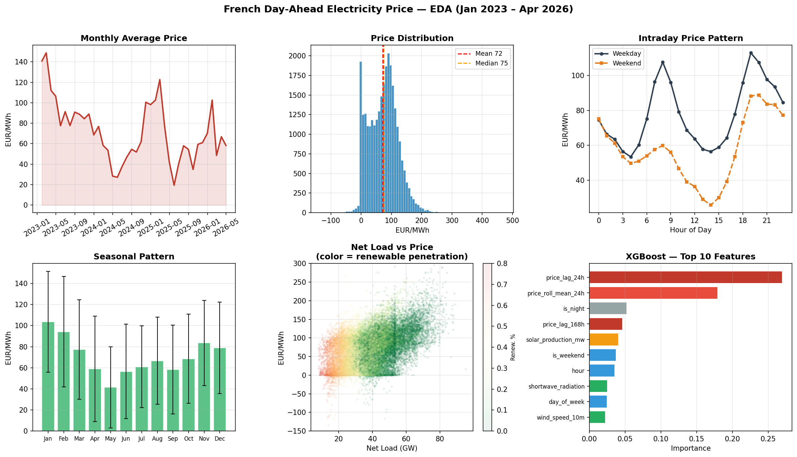

# French Day-Ahead Electricity Price Forecasting — Findings

**Dataset:** ENTSO-E spot prices (FR) + ODRE consumption + Open-Meteo weather  
**Period:** January 2023 – April 2026 · 28 405 hourly observations  
**Target:** Day-ahead electricity price (EUR/MWh), t+24h forecast horizon

---

## 1. Exploratory Data Analysis

### Price dynamics

The French day-ahead price averaged **72 EUR/MWh** over the period, but with extreme dispersion (std = 48 EUR/MWh). The distribution is right-skewed with occasional spikes above 300 EUR/MWh, and **3.8% of hours carry negative prices** — a structural feature of markets with high renewable penetration where excess supply forces prices below zero.

| Statistic | Value |
|-----------|-------|
| Mean | 72 EUR/MWh |
| Median | 75 EUR/MWh |
| Std | 48 EUR/MWh |
| Min | −135 EUR/MWh |
| Max | 473 EUR/MWh |
| Negative hours | 3.8% |

Prices dropped significantly from 2023 to 2024 — from ~97 EUR/MWh to ~58 EUR/MWh — as gas prices normalised after the energy crisis and renewable capacity expanded.

### Seasonality

Two seasonality patterns are clearly visible:

**Intraday:** A classic double-peak pattern with a morning ramp (peak at 8h, ~94 EUR/MWh) and a stronger evening peak (peak at 19h, ~106 EUR/MWh). Weekends are structurally lower by ~20 EUR/MWh due to reduced industrial demand.

**Annual:** Winter months (Jan–Feb) are the most expensive (~94–104 EUR/MWh) driven by heating demand, while spring (Apr–May) is the cheapest (~41–59 EUR/MWh) when demand is low and solar output is rising. This pattern is consistent across all three years.

### Renewable penetration and negative prices

Average renewable penetration is **24%**, but it varies enormously (0–73%). When the price goes negative, average penetration jumps to **36%** — confirming that negative prices are almost exclusively a renewable over-generation event (excess wind + solar with no thermal plants to shut down fast enough).

Net load (gross load minus renewable production) is the single strongest non-lag predictor of price, with a correlation of **0.48**.

### Key feature correlations

The dominant predictors of price are lagged prices — the 24h lag alone correlates at **0.79**, reflecting strong persistence in the market. Beyond lags, net load, temperature, and renewable production are the most informative physical drivers.

| Feature | Correlation with price |
|---------|----------------------|
| price_lag_24h | 0.79 |
| price_roll_mean_24h | 0.78 |
| price_lag_48h | 0.67 |
| price_lag_168h | 0.65 |
| net_load_mw | 0.48 |
| load_mw | 0.46 |
| temperature_2m | 0.34 |

---

## 2. Model Results

All models were evaluated with **walk-forward validation**: train on all past data, predict the next 24 hours, retrain daily — replicating real trading conditions with zero data leakage. Test period covers ~800 days (~19 000 prediction hours).

### Summary table

| Model | MAE (EUR/MWh) | RMSE | R² | Direction Accuracy |
|-------|--------------|------|----|--------------------|
| Ridge Regression | 14.77 | 19.62 | 0.806 | 78.5% |
| XGBoost | **13.41** | **18.34** | **0.831** | 76.7% |
| LightGBM P50 | 13.67 | 19.05 | 0.819 | 76.4% |

### Ridge Regression (baseline)

Ridge is the strongest on **direction accuracy** (78.5%) despite being the weakest on absolute error. Its linear structure works surprisingly well because lagged prices — which are near-linear predictors — dominate the feature space. Fast to retrain daily (< 1 second), making it a solid production baseline.

### XGBoost

Best overall on MAE (−9% vs Ridge) and R² (0.831). The gradient boosting captures non-linear interactions between features — particularly between net load, hour of day, and renewable penetration — that Ridge cannot model. Feature importance analysis shows that the **24h price lag alone accounts for 27% of importance**, with the 24h rolling mean adding another 18%. Physical features (solar production, wind speed) contribute meaningfully but are secondary to price autocorrelation.

**Top features (XGBoost):**

| Feature | Importance | Category |
|---------|-----------|----------|
| price_lag_24h | 27.0% | Historical |
| price_roll_mean_24h | 18.0% | Historical |
| is_night | 5.2% | Calendar |
| price_lag_168h | 4.6% | Historical |
| solar_production_mw | 4.1% | Renewable |
| is_weekend | 3.7% | Calendar |
| hour | 3.5% | Calendar |
| shortwave_radiation | 2.5% | Weather |

### LightGBM Quantile Regression

LightGBM's key contribution is **uncertainty quantification**: instead of a single forecast, it outputs P10/P50/P90 intervals. This is directly actionable for trading — a narrow interval signals high confidence, a wide interval suggests caution.

The P50 median prediction matches XGBoost in accuracy (MAE 13.67). The P10–P90 interval covers **63% of actual prices** (target was 80%), meaning the model is slightly overconfident — the intervals are too narrow on average (33 EUR/MWh mean width). This is a known challenge with quantile regression on electricity prices due to extreme spikes that are difficult to anticipate.

---

## 3. Key Takeaways

- **Price persistence dominates**: the 24h lag explains more variance than all physical features combined. Any model must capture autocorrelation first.
- **Seasonality is strong and consistent**: two intraday peaks, a steep winter premium, a spring trough — all very predictable.
- **Negative prices are a renewable signal**: they occur almost exclusively when renewable penetration exceeds ~35%, and are increasingly frequent as wind/solar capacity grows.
- **XGBoost is the best point forecast**: non-linear interactions give it a consistent edge over Ridge with acceptable training time for daily retraining.
- **LightGBM adds risk information**: the quantile intervals are useful for position sizing even if coverage is imperfect.
- **Direction accuracy (~77–78%) is the trading-relevant metric**: predicting whether price goes up or down correctly more than 3/4 of the time is a meaningful edge over a random strategy (50%).
